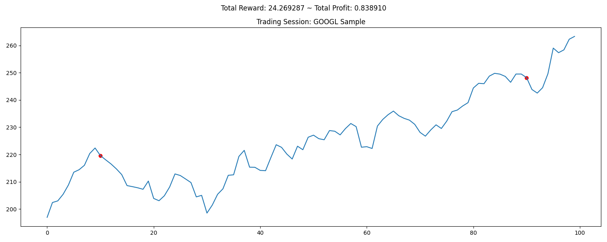

Note: 💔 Work in progress. This is just for learning purposes, and definitely not intended for real-world trading!

# TraderBot

A reinforcement learning based trading bot for financial markets.

## Overview

TraderBot uses transformers and Bayesian models to automate trading decisions in financial markets. The bot is designed to learn from historical data and adapt to changing market conditions. It employs a reinforcement learning algorithm to optimize trading strategies. It uses Ray for distributed training and hyperparameter tuning.

## Project Structure

- `src/`: Core source code
    - `environment.py`: Trading environment simulation
    - `data_processor.py`: Data preparation and feature engineering
    - `backtest.py`: Backtesting framework for strategy evaluation
    - `train.py`: Model training pipeline
    - `models/`: ML model implementations
        - `bayesian.py`: Bayesian model
        - `transformer.py`: Transformer model
    - `data/`: Financial data files (CSV and processed features)
    - `results/`: Storage for experiment results
    - `saved_models/`: Checkpoints for trained models

## Getting Started

### Prerequisites

```
pip install -r requirements.txt
```

### Training a Model

```python
from src.train import train_model

train_model(config_file="default_config")
```

### Running a Backtest

```python
from src.backtest import run_backtest

results = run_backtest(model_path="saved_models/algorithm_state.pkl", 
                                            tickers=["AAPL", "MSFT", "GOOGL", "SPY"])
```

## Testing

Run the test suite:

```
python src/test_environment
```

## Results



